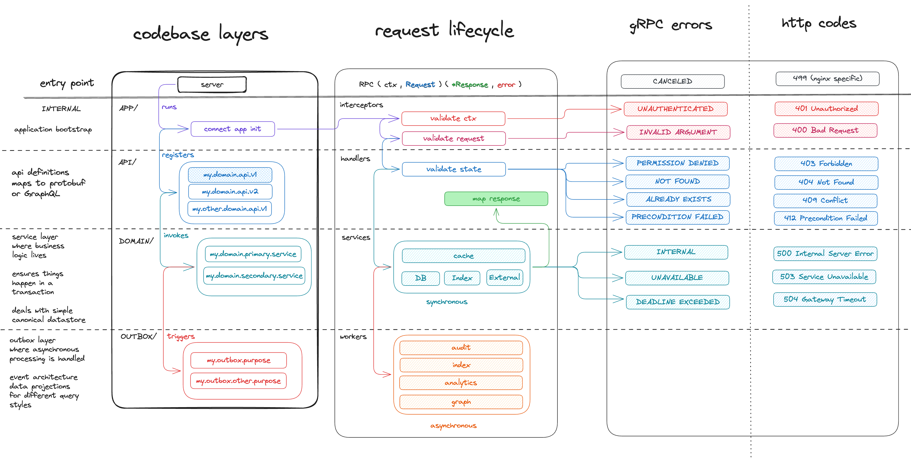
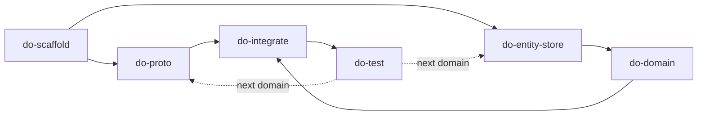

# claude-go-playground

An RPC backend in Go (Connect-RPC or gRPC), built incrementally using Claude Code agents.

## Repo Layout

```
connect-rpc-backend/    # Connect-RPC project
grpc-backend/           # gRPC project
```

Each project is an independent Go module with the same layered architecture:

```
cmd/server/              # entry point — server bootstrap, wiring
internal/
├── api/<domain>/v1/     # handlers, mappers, routes (versioned to match proto)
├── domain/<domain>/     # business logic, operations, errors
└── outbox/<domain>/     # async event workers
pkg/                     # shared utilities — config, cache, app, etc.
protos/<domain>/v1/      # protobuf definitions
sql/                     # migrations + sqlc queries
gen/
├── sdk/                 # buf-generated proto + RPC stubs
└── db/<schema>/         # sqlc-generated query code, grouped by schema (e.g. collaboration)
```

## Architecture



See [`_architecture/ARCHITECTURE.md`](_architecture/ARCHITECTURE.md) for the written reference.

## Tech Stack

- [Go](https://go.dev/doc/)
- [Connect-RPC](https://connectrpc.com/docs/go/getting-started) / [gRPC](https://grpc.io/docs/languages/go/)
- [Buf](https://buf.build/docs/)
- [sqlc](https://docs.sqlc.dev/)
- [goose](https://pressly.github.io/goose/)
- [River](https://riverqueue.com/docs)
- [testcontainers-go](https://golang.testcontainers.org/)
- [Air](https://github.com/air-verse/air) (live-reload via `go tool air`)
- [Delve](https://github.com/go-delve/delve) (debugging via `go tool dlv`)
- [Docker Compose](https://docs.docker.com/compose/) (infra only)
- [Make](https://www.gnu.org/software/make/manual/make.html)

## Agents

Agents are defined in `.claude/agents/` and invocable via slash commands or `claude --agent <name>`.

### Build Agents

Each produces a focused, auditable PR. Run via `/do-<name>` or `claude --agent do-<name>`.

| Agent | Command | What it does | PR audit question |
|-------|---------|-------------|-------------------|
| **do-scaffold** | `/do-scaffold <project>` | Project skeleton — Makefile, Dockerfile, docker-compose, pkg/, cmd/server/, air config | Does the structure match our architecture? |
| **do-proto** | `/do-proto <domain> <project>` | Protobuf definitions with buf/validate annotations, buf.yaml module config | Is the API contract right? |
| **do-entity-store** | `/do-entity-store <domain> <project>` | SQL migration, sqlc queries, sqlc.yaml wiring | Is the data model right? |
| **do-domain** | `/do-domain <domain> <project>` | Business logic service — operations, sentinel errors, outbox events, caching | Is the logic correct? |
| **do-integrate** | `/do-integrate <domain> <project>` | API handler, mapper, route files, outbox workers, cmd/server registration | Is this wired correctly? |
| **do-test** | `/do-test <domain> <project>` | Domain + API + outbox tests with testcontainers, four access levels, parallel subtests | Is this adequately tested? |

### Review Agents

Audit PRs against the architecture checklist. Run via `/review-<name>` or `claude --agent review-<name>`.

| Agent | Command | Reviews PRs from | Audit output |
|-------|---------|-----------------|--------------|
| **review-scaffold** | `/review-scaffold <pr>` | do-scaffold | Structure, Makefile targets, Dockerfile stages, config conventions |
| **review-proto** | `/review-proto <pr>` | do-proto | API contract, validation annotations, naming, buf config |
| **review-entity-store** | `/review-entity-store <pr>` | do-entity-store | Schema design, sqlc queries, proto-to-SQL field consistency |
| **review-domain** | `/review-domain <pr>` | do-domain | Layer rules, transaction patterns, error handling, outbox usage |
| **review-integrate** | `/review-integrate <pr>` | do-integrate | Handler wiring, mapper isolation, route coverage, outbox events |
| **review-test** | `/review-test <pr>` | do-test | Coverage matrix, testcontainers setup, access levels, parallel subtests |

### Agent Workflow

Agents are meant to be run in sequence per domain, with each PR reviewed before moving on:



### Test Architecture

API tests use a two-function setup to avoid unnecessary testcontainers overhead:

- `setupHandler(t)` — no database, panic service. For interceptor-level tests (unauthenticated, invalid argument, permission denied)
- `setupHandlerWithDB(t)` — testcontainers postgres, real service. For domain-level tests (not found, already exists, success)

Each route test file has two parent tests with parallel subtests:

- `Test<Endpoint>_Errors` — shares `setupHandler`, subtests run with `t.Parallel()`
- `Test<Endpoint>_Success` — shares `setupHandlerWithDB`, subtests run with `t.Parallel()`

Four access level clients are available: `anonymous`, `standard`, `admin`, `elevated`.

## Getting Started

```bash
make codegen    # generate proto + sqlc code via docker build
make vet        # codegen + tidy + go vet
make build      # docker build
make infra      # start postgres + opensearch via docker compose
make start      # start infra + server with live-reload (air)
make debug      # start infra + server with debugger (delve on :2345)
make test       # unit + integration tests
make teardown   # stop infra
make clean      # teardown + remove gen/ and tmp/
```
