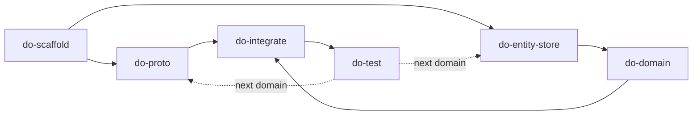

# claude-connect-rpc-playground

A Connect-RPC backend in Go, built incrementally using Claude Code agents.

## Architecture

See [`_architecture/platform-backend.png`](_architecture/platform-backend.png) for the visual mental model.

```
cmd/server/              # entry point — server bootstrap, wiring
internal/
├── api/<domain>/v1/     # handlers, mappers, routes (versioned to match proto)
├── domain/<domain>/     # business logic, operations, errors
└── outbox/<domain>/     # async event workers
pkg/                     # shared utilities — config, cache, connectapp, etc.
protos/<domain>/v1/      # protobuf definitions
sql/                     # migrations + sqlc queries
gen/
├── sdk/                 # buf-generated proto + connect stubs
└── db/<domain>/         # sqlc-generated query code
```

## Tech Stack

- [Go](https://go.dev/doc/)
- [Connect-RPC](https://connectrpc.com/docs/go/getting-started)
- [Buf](https://buf.build/docs/)
- [sqlc](https://docs.sqlc.dev/)
- [goose](https://pressly.github.io/goose/)
- [River](https://riverqueue.com/docs)
- [testcontainers-go](https://golang.testcontainers.org/)
- [Docker Compose](https://docs.docker.com/compose/)
- [Make](https://www.gnu.org/software/make/manual/make.html)

## Agents

Each agent produces a small, auditable PR:

### Build Agents

Each produces a focused, auditable PR:

| Agent | `claude --agent <name>` | PR audit question |
|-------|------------------------|-------------------|
| **do-scaffold** | `claude --agent do-scaffold` | Does the structure match our architecture? |
| **do-proto** | `claude --agent do-proto` | Is the API contract right? |
| **do-entity-store** | `claude --agent do-entity-store` | Is the data model right? |
| **do-domain** | `claude --agent do-domain` | Is the logic correct? |
| **do-integrate** | `claude --agent do-integrate` | Is this wired correctly? |
| **do-test** | `claude --agent do-test` | Is this adequately tested? |

### Review Agents

Subagents invoked during PR review sessions to audit changes:

| Agent | Reviews PRs from | Audit output |
|-------|-----------------|--------------|
| **review-scaffold** | do-scaffold | Structure & conventions checklist |
| **review-proto** | do-proto | API contract & validation annotations |
| **review-entity-store** | do-entity-store | Schema, queries, proto ↔ SQL consistency |
| **review-domain** | do-domain | Logic, layer rules, transaction patterns |
| **review-integrate** | do-integrate | Wiring, route coverage, outbox events |
| **review-test** | do-test | Coverage matrix, testcontainers usage |

### Workflow



## Getting Started

```bash
make vet      # codegen + tidy + go vet
make build    # docker build
make start    # docker compose up + health check
make test     # unit + integration tests
make stop     # tear down
```